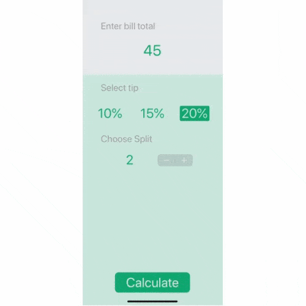

# Quizzler
This app was created as a part of a [Udemy course](https://www.udemy.com/share/101WsWAEMScldUQn8F/) I am taking (April 2020).

The goal was to create an app which can calculate tip and split the total bill between people. 

I changed the tip values from [0%, 10%, 20%] to [10%, 15%, 20%] and allowed the option to "split between 1 person," allowing the app to also be used as a simple tip calculator.

## Lesson Objectives
* How to create multi-screen apps with animated navigation.
* Optional binding, optional chaining and the nil coalescing operator.
* How to create classes and difference between classes and structs.
* Pass by value vs. pass by reference.
* Formatting Strings.
* Color literals.

## Final Result

